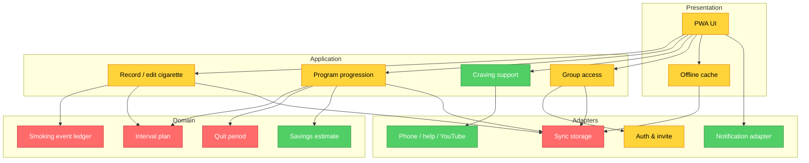

# Brooks-Lint Review

**Mode:** Architecture Audit + UX specification audit  
**Scope:** [developer-spec-v2.md](/Users/sr/Documents/Codex/2026-07-29/realtime-voice-chat-2/outputs/developer-spec-v2.md), 339 строк; кодовой базы пока нет  
**Health Score:** 48/100  
**Trend:** First run — no trend data

ТЗ хорошо фиксирует ценность и тон продукта, но пока не задаёт единый источник правды для времени и изменений истории, а часть UX/технических состояний разработчик будет вынужден придумывать сам.

---

## Module Dependency Graph

Это целевая структура, которую ТЗ должно явно потребовать. Пока она отсутствует в ТЗ, поэтому все узлы кроме UI отмечены как требующие уточнения.

---

## Findings

### 🔴 Critical

**[Dependency Disorder / Domain Model Distortion] — Нет единого правила, как исправление прошлого меняет программу**

Symptom: ТЗ разрешает изменять время и добавлять сигареты задним числом, но одновременно хранит дневную цель, базовую линию, успех дня и накопленные деньги. Не определено, пересчитывается ли после исправления вчерашняя цель, все последующие цели, неделя 16 и дата готовности к отказу.

Source: *Domain-Driven Design* — Aggregate Root and invariant ownership; *A Philosophy of Software Design* — Information Leakage.

Consequence: Разные экраны будут показывать разные цифры либо разработчик «починит» раннюю отметку и неожиданно изменит человеку весь уже пройденный путь. Это критично для доверия к приложению.

Remedy: Ввести append-only `SmokingEvent` как единственный источник фактов и отдельную проекцию `DailyPlanSnapshot`. После полуночи цель дня становится неизменяемым снимком. Исправление в прошлом обновляет историю, статистику и деньги, но не переписывает уже показанные цели последующих дней. Базовую линию разрешить пересчитать только до момента её фиксации в начале сокращения; затем зафиксировать `baseline_version`.

**[Cognitive Overload / Domain Model Distortion] — Сценарий единичной сигареты после отказа неполный**

Symptom: Есть экран «Одна сигарета не отменяет путь», но нет точного действия, которым пользователь фиксирует сигарету в фазе `quit`, нет момента закрытия `quit_period`, а «Вернуться к отказу» не описывает, запускает ли новую серию немедленно.

Source: *Code Complete* — Defensive programming and explicit error paths; *Domain-Driven Design* — Entity lifecycle.

Consequence: Два разработчика реализуют разные состояния, а счётчик дней, награды и история будут расходиться.

Remedy: Зафиксировать state machine: `quit → log_lapse → lapse_review → (resume_quit | return_to_preparation)`. При `log_lapse` завершить текущий `QuitPeriod` с `ended_at=occurred_at`; при `resume_quit` открыть новый `QuitPeriod` с моментом подтверждения; при `return_to_preparation` возобновить фиксированную цель на следующий локальный день. Отдельно определить, может ли человек отменить ошибочную запись о сигарете и как тогда восстановить прежний период.

**[Dependency Disorder] — Группа с чувствительными данными описана без границы доступа**

Symptom: ТЗ требует псевдонимы, статусы, жалобы, администратора пилота, скрытие и удаление данных, но не определяет вход в закрытую группу, роли, серверную авторизацию, срок хранения и реакцию на отзыв согласия.

Source: *Clean Architecture* — policy/detail boundary and Dependency Inversion; *The Mythical Man-Month* — Conceptual Integrity.

Consequence: Нельзя безопасно реализовать «Люди»: статус может оказаться доступен не той группе, жалобы — недоставленными, а удаление — неполным.

Remedy: Для v1 задать один путь: пользователь получает одноразовую invite-ссылку; backend проверяет membership на каждом запросе; роли только `participant` и `pilot_admin`; администратор видит жалобы, но не личную статистику. Описать таблицы `group`, `membership`, `reaction`, `report`, срок хранения и каскад удаления. До готовности этого контура выключить вкладку «Люди» feature flag’ом.

### 🟡 Warning

**[Domain Model Distortion] — “Сегодня не выкурил” не соответствует текущей формуле**

Symptom: Формула считает невыкуренные сигареты с начала сокращения, но карточка говорит «Сегодня ты уже не выкурил 3 сигареты».

Source: *Domain-Driven Design* — Ubiquitous Language.

Consequence: Пользователь видит число, которое выглядит как факт за сегодня, хотя это накопительная оценка; доверие к деньгам и статистике снижается.

Remedy: В v1 назвать карточку «За время программы примерно не выкурено N сигарет» и «Примерно сэкономлено X ₽». Если нужен показатель именно за сегодня, сначала формально определить ожидаемое число сигарет к текущему времени суток; без этого его не показывать.

**[Change Propagation] — Правило 16 недель размазано между календарём, UI и формулами**

Symptom: Числа 7, 8, 105, 106, 112, 113 и 7 дней продления присутствуют в нескольких разделах ТЗ.

Source: *The Pragmatic Programmer* — DRY; Fowler — Duplicate Code.

Consequence: Любое изменение длительности пилота потребует синхронно исправлять алгоритм, тексты, экран плана и тесты.

Remedy: Описать единственный объект конфигурации программы: `observationDays`, `reductionEndDay`, `preparationDays`, `extensionDays`, `dailyStepMin`, `dailyStepMax`, `successThreshold`. UI получает фазы и тексты по идентификатору недели, а не вычисляет дни сам.

**[Cognitive Overload] — Экран «Сегодня» теряет важную обратную связь после дня 8**

Symptom: В наблюдении показаны «Сегодня: N сигарет» и последняя отметка; в активной паузе остаётся только таймер и цель.

Source: *A Philosophy of Software Design* — deep module with a simple, informative interface.

Consequence: Исчезает именно та осознанность, ради которой пользователь первые семь дней отмечал сигареты. Он не видит, сколько уже было сегодня.

Remedy: Во всех фазах держать одну компактную строку под таймером: `Сегодня: N сигарет · последняя M минут назад`. Она не является кнопкой и не провоцирует курение.

**[Cognitive Overload] — Детализация интерфейса ещё не достаточна для одинаковой реализации**

Symptom: Нет дизайн-токенов, размеров отступов, типов кнопок, состояний disabled/loading/error, поведения клавиатуры, модальных окон, skeleton/empty states, максимальной длины текстов и правил переноса.

Source: *Code Complete* — construction clarity; *The Mythical Man-Month* — Conceptual Integrity.

Consequence: Разработчик будет угадывать, и экраны получатся разнородными; особенно рискованны крупный шрифт и узкие телефоны.

Remedy: Добавить UI-приложение: цветовые роли, шрифт/масштаб, 8-pt spacing grid, primary/secondary/tertiary button specs, карточки, snackbar, bottom sheet, empty/loading/offline/error/disabled states и 375px/430px/крупный шрифт макеты. Пять ключевых прототипов должны быть кликабельными до кода.

**[Cognitive Overload] — Статистика перегружена для одного экрана**

Symptom: За одним первым экраном стоят число сигарет, сравнение с первой неделей, график, средний интервал, цель, самая длинная пауза и итог за путь.

Source: *A Philosophy of Software Design* — cognitive load and information hiding.

Consequence: Пользователь 50+ лет скорее прочитает верхнюю цифру и пропустит главную мысль; на маленьком экране появится плотная «панель управления».

Remedy: Оставить сверху один главный вывод (`на N меньше первой недели`), затем график и одну карточку «Пауза». «Самую длинную паузу» и итог за путь перенести ниже фолда или во «Всё время». Сначала прототипировать 375px.

**[Accidental Complexity] — Для пилота слишком много внешних вариантов поддержки**

Symptom: В «Мне сейчас тяжело» одновременно таймер, вода, прогулка, YouTube, звонок и региональная профессиональная ссылка; часть требует настройки, часть — внешние приложения.

Source: Fowler — Speculative Generality; McConnell — YAGNI.

Consequence: Много пограничных состояний и настройки ради сценария, который ещё не проверен; пользователь в тяге получает меню вместо простого действия.

Remedy: В пилоте оставить таймер, воду, прогулку и одну короткую разминку. «Позвонить близкому» и региональную помощь добавить после выбора страны/контакта и проверки сценария. Не прятать профессиональную помощь: она может быть простой постоянной ссылкой в настройках.

**[Change Propagation] — Поиск YouTube не является стабильным контентом**

Symptom: В ТЗ прописаны поисковые URL, результат которых меняется независимо от приложения.

Source: *Software Engineering at Google* — Hyrum’s Law and unstable external behavior.

Consequence: Пользователь может получить неподходящий, рекламный или слишком сложный ролик; тест становится невоспроизводимым.

Remedy: До запуска выбрать 5 конкретных коротких роликов, вручную проверить и хранить `video_id`, название, длительность, язык и fallback-текст. Открывать во внешнем браузере с предупреждением «YouTube покажет внешнее видео».

**[Dependency Disorder] — Не определены аутентификация, синхронизация и конфликты offline-first PWA**

Symptom: Требуются закрытая группа, локальное сохранение и синхронизация без дублей, но нет способа входа, идентификаторов запросов, правила merge и экрана конфликтов.

Source: *Clean Architecture* — adapters and seams; Feathers — seams for testability.

Consequence: При повторной отправке или работе с двух устройств появятся двойные сигареты и разные таймеры.

Remedy: Зафиксировать один auth-путь (например, magic link), UUID события создаётся клиентом, сервер принимает idempotent upsert, версия записи используется для редактирования, конфликт показывает «На другом устройстве есть изменение» с выбором времени. До появления auth разрешить тест только на одном устройстве.

**[Domain Model Distortion] — Нет правил валидации времени, цены и пачки**

Symptom: Пользователь может сохранить будущую сигарету, отрицательную цену, 0 сигарет в пачке либо отметку раньше начала программы.

Source: *Code Complete* — defensive programming.

Consequence: Деление на ноль, отрицательные интервалы, сломанные деньги и непонятные таймеры.

Remedy: Явно задать инварианты: время не позже «сейчас + 5 минут», не раньше старта программы; цена > 0; сигарет в пачке — целое 1–100; денежная цель > 0; при невалидности — текст ошибки под полем, значение не сохранять.

**[Change Propagation] — Согласие, аналитика и удаление данных не связаны**

Symptom: Есть согласие пилота, анонимная аналитика и удаление, но не определены версии согласия, список событий, идентификатор согласия в событиях и поведение при отзыве.

Source: *The Pragmatic Programmer* — Orthogonality; *Software Engineering at Google* — sustainable contracts.

Consequence: Нельзя доказать, на что согласился участник, или корректно выключить аналитику после отзыва.

Remedy: Хранить `consent_version`, `consented_at`, флаги `product_data`, `pilot_analytics`, `group_visibility`. Перечислить аналитические события и срок хранения. Отзыв согласия прекращает новые события и запускает удаление/анонимизацию по заранее зафиксированному правилу.

**[Testability] — Приёмочных сценариев недостаточно для алгоритма с временем**

Symptom: Есть 8 happy-path сценариев, но нет тестов границы дня, правки первой недели, повторной синхронизации, часовых поясов, пустой базовой линии, будущей даты, удаления и возврата из режима отказа.

Source: *How Google Tests Software* — change coverage; Osherove — edge-path tests.

Consequence: Самые рискованные ошибки проявятся только у тестировщиков: неверный шаг, сдвоенная отметка, неверная серия.

Remedy: Добавить таблицу минимум из 25 детерминированных test cases и вынести расчёт в чистую функцию с фиксированными `now` и timezone. Критические: 0/1/2 сигареты, сон, полночь, backfill, отмена, дубль sync, продление подготовки, lapse и отмена lapse.

### 🟢 Suggestion

**[Knowledge Duplication] — Термины “цель”, “пауза”, “интервал” используются как взаимозаменяемые**

Symptom: Один бизнес-объект в ТЗ называется тремя словами.

Source: *Domain-Driven Design* — Ubiquitous Language.

Consequence: В UI и коде появятся разные переменные и фразы для одного понятия.

Remedy: Утвердить словарь: `цель-пауза` в интерфейсе, `target_interval_minutes` в домене; «интервал» — только фактическое расстояние между отметками.

**[Accidental Complexity] — Награды и недельный показатель микро-заданий пока не связаны с мотивацией**

Symptom: Вода и деньги не влияют на серию/награды, но в интерфейсе есть «N микрошагов 🔥» без описанной пользы.

Source: McConnell — YAGNI.

Consequence: Это может стать декоративной метрикой, которую разработчик и пользователь поддерживают без ценности.

Remedy: В пилоте оставить счётчик как информацию. Награду «7 дней заботы о себе» добавлять только если тест покажет, что людям это приятно, а не давит.

**[Cognitive Overload] — Не задано поведение для участника, который не хочет денег или задач**

Symptom: Цену пачки можно пропустить, но не описаны пустая карточка и отключение «Здоровья»; задания всегда существуют.

Source: *A Philosophy of Software Design* — simple defaults.

Consequence: Экран может казаться пустым либо навязчивым для части тестировщиков.

Remedy: Добавить варианты: без цены показать «Добавь цену пачки — увидишь примерную экономию» с маленькой кнопкой; задания — `Скрыть на неделю` в настройках, без влияния на основной путь.

**[Cognitive Overload] — Пять вкладок плюс аватар и кубок требуют явного приоритета на мобильном**

Symptom: Формально нижняя навигация допустима, но дополнительный профиль и награды создают семь направлений.

Source: Apple Human Interface Guidelines — tab bars present top-level information categories.

Consequence: У части пользователей «Награды» могут остаться незаметными, а иконка кубка — неочевидной.

Remedy: В первой версии разместить награды карточкой внутри «Плана» с переходом «Все награды», а не только иконкой. Tab bar не расширять.

## Summary

Самое важное — формально зафиксировать время как доменную модель: что происходит с целью, историей и серией после редактирования прошлой отметки. Затем ограничить пилот до стабильных сценариев и добавить UI-приложение с состояниями/макетами, иначе разработчик будет принимать продуктовые решения вместо вас. Хорошая часть ТЗ — тёплый основной путь и отсутствие наказаний; после устранения трёх Critical пунктов он станет надёжной основой для реализации.

## UX и accessibility checklist до приёмки

- Проверить интерфейс на ширине 375px, 430px, крупном системном шрифте и тёмной теме.
- Ни один tappable элемент не меньше 44×44 pt; это более консервативно, чем минимум WCAG 2.2 AA 24×24 CSS px. [W3C WCAG 2.2](https://www.w3.org/TR/WCAG22/)
- Текст и статус не должны зависеть только от цвета; проверить контраст AA.
- Проверить фокус с клавиатуры и screen reader labels для таймера, графика, иконок кубка/профиля и snackbars.
- Каждый внешний переход (YouTube, звонок, помощь) должен быть подписан, открываться предсказуемо и иметь безопасный fallback.
- Tab bar должен оставаться видимым при переходе между верхнеуровневыми разделами. [Apple HIG: Tab bars](https://developer.apple.com/design/human-interface-guidelines/tab-bars?changes=l_1__4&language=objc)
- Протестировать на 2–3 пользователях 50+ три сценария: первая отметка, ранняя сигарета во время таймера, исправление ошибочной отметки.
